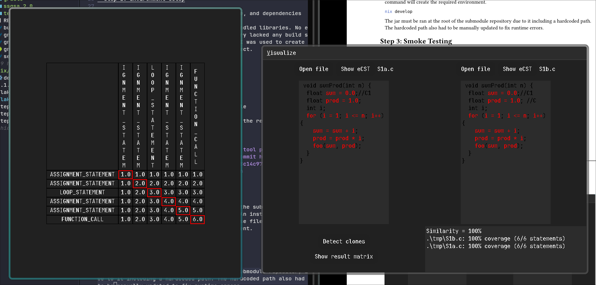

# LICCA – Reproducibility Report

## 1. Artifact Discovery

Official artifact link how the artifact was discovered, verification notes

The original artifact in the paper has since been made private (https://github.com/tvislavski/licca) and as such is not accessible.

However, I found a fork at https://github.com/gocko/licca. I of course cannot validate if it is the exact tool mentioned in the paper but according to my best judgement, it must be extremely close or perfect. I spoke with the professor and he said I may use this repository.

The original instructions were unavilable, as such I had to directly modify some parts of the codebase to get it to run. All of which are specified.

### Broken Links

Github Repository: https://github.com/tvislavski/licca

## 2. Environment Setup

Operating system, programming language & version, dependencies, hardware (if needed)

The codebase language is based on java and as such should run on any Java compatible operating system. The only requirement was java and its bundled libraries. All external dependencies were bundled in the repository as binary jars.

<details>
<summary>/etc/os-release</summary>
```
ANSI_COLOR="0;38;2;126;186;228"
BUG_REPORT_URL="https://github.com/NixOS/nixpkgs/issues"
BUILD_ID="25.11.20260128.fa83fd8"
CPE_NAME="cpe:/o:nixos:nixos:25.11"
DEFAULT_HOSTNAME=nixos
DOCUMENTATION_URL="https://nixos.org/learn.html"
HOME_URL="https://nixos.org/"
ID=nixos
ID_LIKE=""
IMAGE_ID=""
IMAGE_VERSION=""
LOGO="nix-snowflake"
NAME=NixOS
PRETTY_NAME="NixOS 25.11 (Xantusia)"
SUPPORT_END="2026-06-30"
SUPPORT_URL="https://nixos.org/community.html"
VARIANT=""
VARIANT_ID=""
VENDOR_NAME=NixOS
VENDOR_URL="https://nixos.org/"
VERSION="25.11 (Xantusia)"
VERSION_CODENAME=xantusia
VERSION_ID="25.11"
```
</details>

The environment can be reproduced using the submitted nix flake alongside lockfiles for exact environments. An install of the nix package manager will be required to use those files. The following command will create the required environment.

```sh
nix develop
```

For other distributions, a copy of java and gradle is required.

```sh
sudo apt install openjdk-21-jdk gradle
```

## 3. Installation and Execution Steps

Installation commands used, execution commands used

The following gradle command can be ran to create jars.

```sh

# if the submodule wasn't cloned
git submodule update --init --recursive

# In the licca submodule
cd ./LICCA/licca

# build stuff
./gradlew :clone_ui:fatJar
./gradlew :clone_detection:fatJar
./gradlew :ecst_generator:fatJar
```

The jar **must be ran at the root of the repository** due to it including a hardcoded path.

```
java -jar LICCA/licca/ssqsa_2.0/CloneUI/build/libs/clone_ui-2.0.0-fat.jar
```

## 4. Benchmarks Used

Benchmark name(s), dataset size (if subset used), settings used

Benchmark: BigCloneBench

Could not run the benchmark, failed with the following error(s).

<details>
<summary>Output</summary>
Importing clones...
java.sql.SQLException: Unable to open a test connection to the given database. JDBC url = jdbc:h2:/home/abaan404/Development/git/CMPT470-M3/LICCA/BigCloneEval/bigclonebenchdb/bcb;IFEXISTS
=TRUE, username = sa. Terminating connection pool (set lazyInit to true if you expect to start your database after your app). Original Exception: ------
org.h2.jdbc.JdbcSQLException: Database "/home/abaan404/Development/git/CMPT470-M3/LICCA/BigCloneEval/bigclonebenchdb/bcb" not found [90013-176]
        at org.h2.message.DbException.getJdbcSQLException(DbException.java:344)
        at org.h2.message.DbException.get(DbException.java:178)
        at org.h2.message.DbException.get(DbException.java:154)
        at org.h2.engine.Engine.openSession(Engine.java:55)
        at org.h2.engine.Engine.openSession(Engine.java:164)
        at org.h2.engine.Engine.createSessionAndValidate(Engine.java:142)
        at org.h2.engine.Engine.createSession(Engine.java:125)
        at org.h2.engine.Engine.createSession(Engine.java:27)
        at org.h2.engine.SessionRemote.connectEmbeddedOrServer(SessionRemote.java:331)
        at org.h2.jdbc.JdbcConnection.<init>(JdbcConnection.java:107)
        at org.h2.jdbc.JdbcConnection.<init>(JdbcConnection.java:91)
        at org.h2.Driver.connect(Driver.java:74)
        at java.sql/java.sql.DriverManager.getConnection(DriverManager.java:683)
        at java.sql/java.sql.DriverManager.getConnection(DriverManager.java:230)
        at com.jolbox.bonecp.BoneCP.obtainRawInternalConnection(BoneCP.java:363)
        at com.jolbox.bonecp.BoneCP.<init>(BoneCP.java:416)
        at database.BigCloneBenchDB.<init>(BigCloneBenchDB.java:44)
        at database.BigCloneBenchDB.getConnectionPool(BigCloneBenchDB.java:31)
        at database.BigCloneBenchDB.getConnection(BigCloneBenchDB.java:48)
        at database.Functionalities.getFunctionalityIds(Functionalities.java:15)
        at evaluate.ToolEvaluator.<init>(ToolEvaluator.java:2480)
        at tasks.EvaluateRecall.call(EvaluateRecall.java:86)
        at tasks.EvaluateRecall.call(EvaluateRecall.java:21)
        at picocli.CommandLine.executeUserObject(CommandLine.java:1743)
        at picocli.CommandLine.access$900(CommandLine.java:145)
        at picocli.CommandLine$RunLast.handle(CommandLine.java:2101)
        at picocli.CommandLine$RunLast.handle(CommandLine.java:2068)
        at picocli.CommandLine$AbstractParseResultHandler.execute(CommandLine.java:1935)
        at picocli.CommandLine.execute(CommandLine.java:1864)
        at tasks.BigCloneBench.main(BigCloneBench.java:31)
------

        at java.base/jdk.internal.reflect.DirectConstructorHandleAccessor.newInstance(DirectConstructorHandleAccessor.java:62)
        at java.base/java.lang.reflect.Constructor.newInstanceWithCaller(Constructor.java:502)
        at java.base/java.lang.reflect.Constructor.newInstance(Constructor.java:486)
        at com.jolbox.bonecp.PoolUtil.generateSQLException(PoolUtil.java:192)
        at com.jolbox.bonecp.BoneCP.<init>(BoneCP.java:422)
        at database.BigCloneBenchDB.<init>(BigCloneBenchDB.java:44)
        at database.BigCloneBenchDB.getConnectionPool(BigCloneBenchDB.java:31)
        at database.BigCloneBenchDB.getConnection(BigCloneBenchDB.java:48)
        at database.Functionalities.getFunctionalityIds(Functionalities.java:15)
        at evaluate.ToolEvaluator.<init>(ToolEvaluator.java:2480)
        at tasks.EvaluateRecall.call(EvaluateRecall.java:86)
        at tasks.EvaluateRecall.call(EvaluateRecall.java:21)
        at picocli.CommandLine.executeUserObject(CommandLine.java:1743)
        at picocli.CommandLine.access$900(CommandLine.java:145)
        at picocli.CommandLine$RunLast.handle(CommandLine.java:2101)
        at picocli.CommandLine$RunLast.handle(CommandLine.java:2068)
        at picocli.CommandLine$AbstractParseResultHandler.execute(CommandLine.java:1935)
        at picocli.CommandLine.execute(CommandLine.java:1864)
        at tasks.BigCloneBench.main(BigCloneBench.java:31)
Caused by: org.h2.jdbc.JdbcSQLException: Database "/home/abaan404/Development/git/CMPT470-M3/LICCA/BigCloneEval/bigclonebenchdb/bcb" not found [90013-176]
        at org.h2.message.DbException.getJdbcSQLException(DbException.java:344)
        at org.h2.message.DbException.get(DbException.java:178)
        at org.h2.message.DbException.get(DbException.java:154)
        at org.h2.engine.Engine.openSession(Engine.java:55)
        at org.h2.engine.Engine.openSession(Engine.java:164)
        at org.h2.engine.Engine.createSessionAndValidate(Engine.java:142)
        at org.h2.engine.Engine.createSession(Engine.java:125)
        at org.h2.engine.Engine.createSession(Engine.java:27)
        at org.h2.engine.SessionRemote.connectEmbeddedOrServer(SessionRemote.java:331)
        at org.h2.jdbc.JdbcConnection.<init>(JdbcConnection.java:107)
        at org.h2.jdbc.JdbcConnection.<init>(JdbcConnection.java:91)
        at org.h2.Driver.connect(Driver.java:74)
        at java.sql/java.sql.DriverManager.getConnection(DriverManager.java:683)
        at java.sql/java.sql.DriverManager.getConnection(DriverManager.java:230)
        at com.jolbox.bonecp.BoneCP.obtainRawInternalConnection(BoneCP.java:363)
        at com.jolbox.bonecp.BoneCP.<init>(BoneCP.java:416)
        ... 14 more
</details>

## 5. Interventions Performed

Description of any fixes, dependency updates, configuration changes, or troubleshooting steps

The repository lacked any build systems as only Java files were present. GenAI was used to create the build files (gradle) to compile the project. All files ending with `*.gradle` are added by me.

The hardcoded path also had to be manually updated in `./licca/ssqsa_2.0/eCSTGenerator_v2.0/src/Languages/Languages.java` to fix runtime errors.

## 6. Execution Outcome

Did the tool run succesfully, did it complete the full workflow, any crashes or partial execution?

The tool ran successfully. The workflow completed partially as the Benchmark itself crashed.



## 7. TES Classification

Final TES category & justification

TES-C: The tool ran successfully but the benchmark kept running into runtime errors. Could not complete the benchmark.
